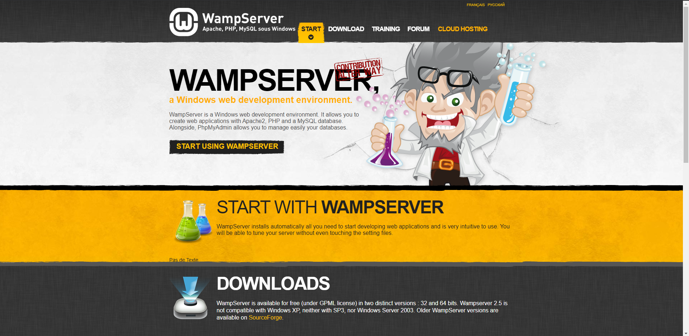

<h2 align="center">Learn PHP - Course &nbsp;🐘&nbsp;</h2>

<p align="center">
  
  <a href="https://github.com/BrianMarquez3/PHP-Course/tags">
    
  </a>
  <a href="https://github.com/BrianMarquez3/PHP-Course/stargazers">
    
  </a>
  <a href="https://github.com/BrianMarquez3/PHP-Course/network">
    
  </a>
  <a href="https://github.com/BrianMarquez3/C-Plus-Plus-Course/network">
    
  </a>
   <a href="https://github.com/BrianMarquez3/C-Plus-Plus-Course/network">
    
  </a>
   <a href="https://github.com/BrianMarquez3/C-Plus-Plus-Course/network">
    
  </a>
   <a href="https://github.com/BrianMarquez3/C-Plus-Plus-Course/network">
    
  </a>
</p>
  

## Tabla de contenidos

- [Que es PHP](#Que-es-PHP)
- [Cualidades](#Cualidades)
- [Desarrollo Web](#Desarrollo-Web)
- [Servidores](#Servidores)
- [La Web Dinamica](#La-Web-Dinamica)
- [XAMPP](#XAMPP)
- [Servidor Portable](#Servidor-Portable)
- [Post Instalacion](#Post-Instalacion)
- [Entorno de Desarrollo](#Entorno-de-Desarrollo)
- [Codigo](#Codigo)
- [Cadenas de texto](#Cadenas-de-texto)
- [Heredoc](#Heredoc)
- [Niveles de Error](#Niveles-de-Error)
- [Operadores](#Operadores)
- [Operadores de Comparación](#Operadores-de-Comparación)
- [Operador Ternario](#Operador-Ternario)
- [Operador "Nave Espacial](#Operador-"Nave-Espacial")
- [Ciclos](#Ciclos)
- [Matrices](#Matrices)
- [Play List PHP](#Spotify-PHP)


## Que es PHP

PHP (acrónimo recursivo de PHP: Hypertext Preprocessor) es un lenguaje de código abierto muy popular especialmente adecuado para el desarrollo web y que puede ser incrustado en HTML.

* [PHP](https://www.php.net/downloads.php)
* [MYSQL](https://www.mysql.com/downloads)

## Cualidades

- Desarrollo de web dinamico
- No tiene costo
- Multiplataforma
- Servicio Automatizado

## Desarrollo Web

| LADO DEL CLIENTE                                             |     LADO DEL SERVIDOR            |  
|--------------------------------------------------------------|:--------------------------------:|
| HTML                                                         |PHP                               |    
| CSS                                                          |PHP                               | 
| JAVASCRIPTS                                                  |PHP                               |       

## Servidores

<p>WampServer es un entorno de desarrollo web de Windows. Te permite crear aplicaciones web con Apache2, PHP y una base de datos MySQL. Además, PhpMyAdmin le permite administrar fácilmente sus bases de datos.</p>



## La Web Dinamica
 
- Una Página web dinámica genera su contenido según la petición de un usuario o contexto de la misma.
- Todo desde la programación (con las estructura y funciones del lenguaje)
- La Información accedida puede administrarse desde una base de datos.

## XAMPP

_Paquetes instaladores servidores_

* [WAMP](https://sourceforge.net/projects/wampserver/) - WampServer es una plataforma de desarrollo web en Windows que le permite crear aplicaciones web dinámicas con Apache2, PHP, MySQL y MariaDB. 
* [MAMP](https://www.mamp.info/en/downloads/) - MAMP instala un entorno de servidor local en cuestión de segundos en su computadora Windows o macOS. MAMP es gratuito y se instala fácilmente.
* [XAMP](https://www.apachefriends.org/download.html) - XAMPP es una distribución de Apache fácil de instalar que contiene MariaDB, PHP y Perl. Simplemente descargue e inicie el instalador. Es fácil.


## Servidor Portable

* [ZWAMP (Portable oficial, Windows)](https://sourceforge.net/projects/zwamp/) - Un paquete de servidor web ligero de instalación cero que se ejecuta en Windows. El proyecto tiene como objetivo proporcionar las últimas versiones de producción / estables de Apache, MySQL, PHP, Adminer, MongoDB, MemCached, SQLite, eAccelerator y Alternative PHP Cache (APC) para impulsar el rendimiento del servidor.
* [ZWAMP alterado (No oficial)](https://github.com/BrianMarquez3/PHP-Course/blob/main/Resource/zwamp%20portable.rar) - Un paquete Portable Modificado


## Post Instalacion

`WAMPP` C:\wamp\htdocs  <br>
`XAMPP` C:\xampp\htdocs  <br>
`ZWAMP` /drive/web <br>
`MAMP` /Applications/MAMO/htdocs <br>
`LINUX` /var\www/html  <br>

## Entorno de Desarrollo

* Visual Studio Code
* Sublime Text
* Brackets
* Notepad++
* DreamWeaver
* TextMate

##  Codigo


_Apertura nativa de PHP_
```js
<?php
  CODIGO PHP
?>
```

_Apertura corta (poco segura)_

```js
<?
  CODIGO PHP
?>
```

## Cadenas de texto

- Toda cadena de texto debe mostrarse en trer comilllas (sean dobles o simples)

- Cualquier Srting o que no esté "encomilado " PHP tratára de evauarlo como 
    - Una Palabre reservada del lenguaje
    - Una constante (aunque no se encuntre en mayúscula)

## Heredoc

- Heredoc es una manera "Alternativa" de delimitar y finalizar de un string.

- Tanto para hacer echo o guardar es una varable, se inicia con la secuencia de trers signos menores <<<

- Junto a los <<< viene una secuencia de caracteres delimitadores a tu eleccion

```js
$lista = <<<HEREDOC
    <ul>
        <li>$alumno1, el el primer alumno </li>
        <li>$alumno2, el el segundo 'mejor' alumno </li>
        <li>$alumno3, es el "ultimo alumno </li>
    </ul>

HEREDOC;
?>
```
## Niveles de Error

* E_ERROR : Error grave (fatal error)
* E_WARNING: Error leve (non-fatal error)
* E_PARSE: Error sintactico o de parseo
* E NOTICE: Avisos de Interprete de PHP 

## Operadores

* Las variables numericas se pueden modificar con uno operadores especiales:

-   INCREMENTO (de uno en uno): variable++ ✔️ variable = variable +1
-   DECREMENTO (de uno en uno): variable-- ✔️ variable = variable -1
-   INCREMENTO (mas de uno): variable += 5 ✔️ variable = variable +5
-   DECREMENT (mas de uno):  variable -= 5 ✔️ variable = variable -5

## Operadores de Comparación

Partiendo de valores de cualquier tipo , nos devolverá un resultado de tipo <b>Booleano</b>

✨   Mayor que: > <br>
✨   Menor que: < <br>
✨   Mayor o Igual que: >= <br>
✨   Menor o igual que: <= <br>
✨   Comparacion: == <br>

## Operador Ternario 

_Ejemplo_

```js
$logueado = true;

echo $logueado ==true ? # pregunta para hacer una evaluacion
    'usuario logueado ' :
    'usuario sin autentificar';
?>
```


## Operador "Nave Espacial"

Introducido en PHP 7 (no existe en las versiones anteriores), este operador permite saber si el primer valor es menor , igual o mayor al segundo valor.


## Ciclos

- El Ciclo de repeticion <b>for</b> es uan esctructura finita, Al escribir el codigo le indicamos a PHP la cantidad de veces que debe ejecutarse.

- Para eso le debemos indicar tres datos al crearlo:

  * <b>Inicio</b> del ciclo: Inicializando una variable de tipo number
  * <b>Limite</b> de las repeteciones: Una Comparacion (de cualquie tipo) que evaluae el valor de esa variable.
  * <b>Desplazamiento</b> de la variable: Cualquier operacion aritmetica que modifique la variable inicial (de forma que llegue al limite)

## Matrices

- Una matriz es un array que tiene otros arrays como elementos.
- Se utiliza cuando por cada elemento del array principal necesitamos manipular mas informacion.


## Spotify PHP
Music Python [List on Spotify](https://open.spotify.com/playlist/1npVE06BugI94aziBCozO1?si=okfjVV9CRF2Xjji-v66WFw)


