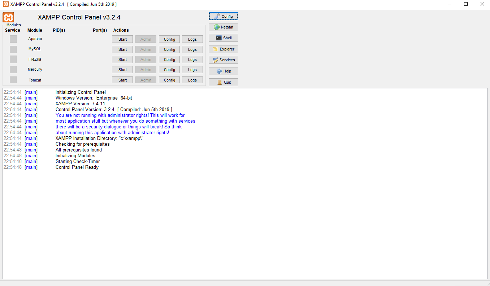
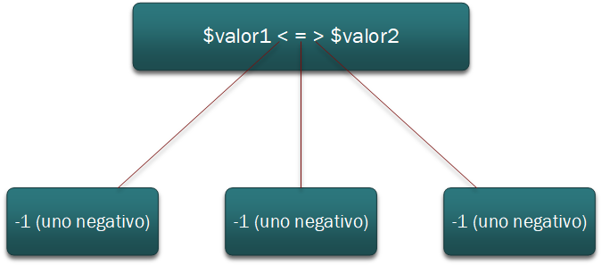
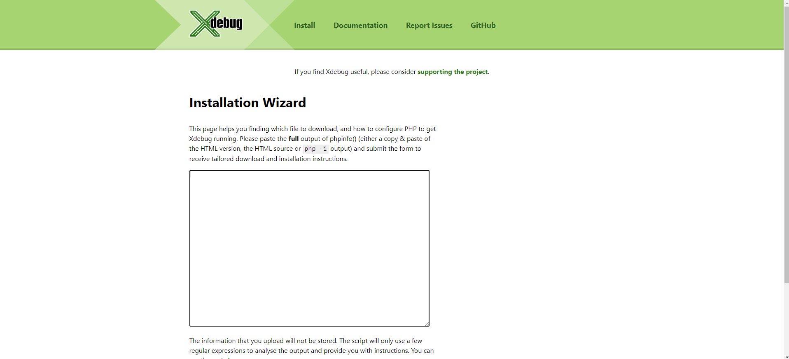
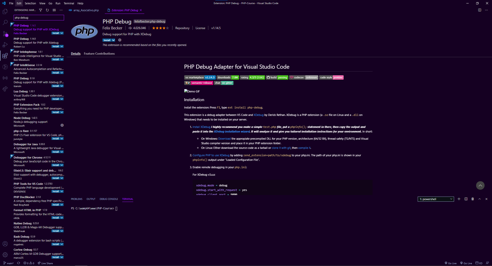
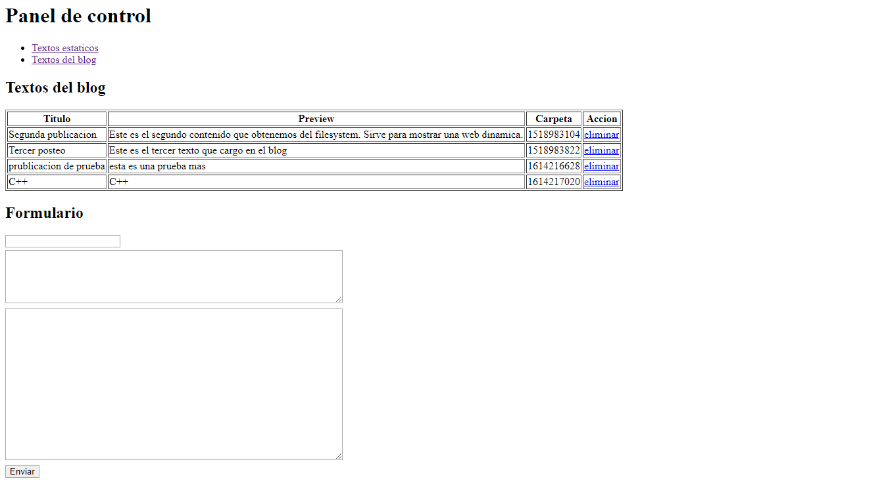

<h2 align="center"> Learn PHP Beginner To Advanced | PHP Course 🐘&nbsp;</h2>

<p align="center">
  
   </a>
    
  </a>
  <a href="https://github.com/BrianMarquez3/PHP-Course/stargazers">
    
  </a>
  <a href="https://github.com/BrianMarquez3/PHP-Course/network">
    
  </a>
    
  </a>
  
  </a>
    
  </a>
  
  </a>
    
  </a>
  
   </a>
   <a href="https://github.com/BrianMarquez3/PHP-Course/network">
    
  </a><br>
 
  
  
  
</p>
  

## Tabla de contenidos

| Numeration   | Check  |Topic          | Quantization     |    Edit Gitpot    |    Downloads    |  link   |
| ------------ |--------|-------------- |----------------- |------------------ |---------------- |-------- |
|  A   |:heavy_check_mark: | [Que es PHP](#Que-es-PHP)   |   :hourglass:     | - | - | [ ⬅️ Atras](https://github.com/BrianMarquez3) | 
|  B   |✔️ | [Cualidades](#Cualidades)  |  
|  C   |✔️ | [Desarrollo Web](#Desarrollo-Web) |  
|  001 |✔️ | [Servidores](#Servidores)  |  
|  002 |✔️ | [La Web Dinamica](#La-Web-Dinamica)  |  
|  003 |✔️ | [XAMPP](#XAMPP)  |  
|  004 |✔️ | [Servidor Portable](#Servidor-Portable) |  
|  005 |✔️ | [Post Instalacion](#Post-Instalacion)  |  
|  006 |✔️ | [Entorno de Desarrollo](#Entorno-de-Desarrollo)  |  
|  007 |✔️ | [Codigo](#Codigo) |  
|  008 |✔️ | [Cadenas de texto](#Cadenas-de-texto)   |  
|  009 |✔️ | [Heredoc](#Heredoc)  |  
|  010 |✔️ | [Niveles de Error](#Niveles-de-Error)  |  
|  011 |✔️ | [Operadores](#Operadores)   |  
|  012 |✔️ | [Operadores de Comparación](#Operadores-de-Comparación)  |  
|  013 |✔️ | [Operador Ternario](#Operador-Ternario)   |  
|  014 |✔️ | [Operador "Nave Espacial](#Operador-"Nave-Espacial")  |  
|  015 |✔️ | [Ciclos](#Ciclos)   |  
|  016 |✔️ | [Matrices](#Matrices)   |  
|  017 |✔️ | [Array Asociativo](#Array-Asociativo)  |  
|  018 |✔️ | [Iteración de Arrays asociativos](#Iteración-de-Arrays-asociativos)   |  
|  019 |✔️ | [Funciones para el manejo de Arrays](#Funciones-para-el-manejo-de-Arrays)  |  
|  020 |✔️ | [Paso de datos entre documentos GET y POST](#Paso-de-datos-entre-documentos-GET-y-POST)  |  
|  021 |✔️ | [Formularios](#formularios-i)  |  
|  022 |✔️ | [Formularios II](#formularios-ii)  |  
|  023 |✔️ | [Envio de checkbox mediante Formularios](#Envio-de-checkbox-mediante-Formularios)  |  
|  024 |✔️ | [Navegación de una web usando templates](#Navegación-de-una-web-usando-templates)  |  
|  025 |✔️ | [Inclusion de plantillas con include y requires](#Inclusion-de-plantillas-con-include-y-requires)  |  
|  026 |✔️ | [Creando un archivo de setup para la web](#Creando-un-archivo-de-setup-para-la-web)  |  
|  027 |✔️ | [Verificaciones Obligatorias en el envio de datos](#Verificaciones-Obligatorias-en-el-envio-de-datos)  |  
|  028 |✔️ | [Debbug](#debbug)  |  
|  029 |✔️ | [EL Array SERVER](#EL-Array-SERVER)  |  
|  030 |✔️ | [Leer y escribir archivos en el servidor](#Leer-y-escribir-archivos-en-el-servidor)  |  
|  031 |✔️ | [Leer y escribir archivos en el servidor](#Leer-y-escribir-archivos-en-el-servidor)  |  
|  032 |✔️ | [Recorrer archivos específicos del servidor](#Recorrer-archivos-específicos-del-servidor)  |  
|  033 |✔️ | [Obtener informacion de los archivos](#Obtener-informacion-de-los-archivos)  
|  033 |✔️ | [Crear y eliminar directorios en el servidor](#Crear-y-eliminar-directorios-en-el-servidor)  
|  - |✔️ | [Play List PHP](#Spotify-PHP)  |  

---
## Que es PHP

PHP (acrónimo recursivo de PHP: Hypertext Preprocessor) es un lenguaje de código abierto muy popular especialmente adecuado para el desarrollo web y que puede ser incrustado en HTML.

* [PHP](https://www.php.net/downloads.php)
* [MYSQL](https://www.mysql.com/downloads)

## Cualidades

- Desarrollo de web dinamico
- No tiene costo
- Multiplataforma
- Servicio Automatizado

## Desarrollo Web

| LADO DEL CLIENTE                                             |     LADO DEL SERVIDOR            |  
|--------------------------------------------------------------|:--------------------------------:|
| HTML                                                         |PHP                               |    
| CSS                                                          |PHP                               | 
| JAVASCRIPTS                                                  |PHP                               |       

## Servidores

<p>WampServer es un entorno de desarrollo web de Windows. Te permite crear aplicaciones web con Apache2, PHP y una base de datos MySQL. Además, PhpMyAdmin le permite administrar fácilmente sus bases de datos.</p>


## La Web Dinamica
 
- Una Página web dinámica genera su contenido según la petición de un usuario o contexto de la misma.
- Todo desde la programación (con las estructura y funciones del lenguaje)
- La Información accedida puede administrarse desde una base de datos.

## XAMPP

_Paquetes instaladores servidores_

* [WAMP](https://sourceforge.net/projects/wampserver/) - WampServer es una plataforma de desarrollo web en Windows que le permite crear aplicaciones web dinámicas con Apache2, PHP, MySQL y MariaDB. <br>
	- Solucion Error  MSVCR110.edll
	* [Visual C++ Redistributable for Visual Studio 2012 Update 4 ](https://www.microsoft.com/en-us/download/details.aspx?id=30679)

* [MAMP](https://www.mamp.info/en/downloads/) - MAMP instala un entorno de servidor local en cuestión de segundos en su computadora Windows o macOS. MAMP es gratuito y se instala fácilmente.
* [XAMP](https://www.apachefriends.org/download.html) - XAMPP es una distribución de Apache fácil de instalar que contiene MariaDB, PHP y Perl. Simplemente descargue e inicie el instalador. Es fácil.



## Servidor Portable

* [ZWAMP (Portable oficial, Windows)](https://sourceforge.net/projects/zwamp/) - Un paquete de servidor web ligero de instalación cero que se ejecuta en Windows. El proyecto tiene como objetivo proporcionar las últimas versiones de producción / estables de Apache, MySQL, PHP, Adminer, MongoDB, MemCached, SQLite, eAccelerator y Alternative PHP Cache (APC) para impulsar el rendimiento del servidor.
* [ZWAMP alterado (No oficial)](https://github.com/BrianMarquez3/PHP-Course/blob/main/Resource/zwamp%20portable.rar) - Un paquete Portable Modificado


## Post Instalacion

`WAMPP` C:\wamp\htdocs  <br>
`XAMPP` C:\xampp\htdocs  <br>
`ZWAMP` /drive/web <br>
`MAMP` /Applications/MAMO/htdocs <br>
`LINUX` /var\www/html  <br>

## Entorno de Desarrollo

* Visual Studio Code
* Sublime Text
* Brackets
* Notepad++
* DreamWeaver
* TextMate

##  Codigo


_Apertura nativa de PHP_
```js
<?php
  CODIGO PHP
?>
```

_Apertura corta (poco segura)_

```js
<?
  CODIGO PHP
?>
```

## Cadenas de texto

- Toda cadena de texto debe mostrarse en trer comilllas (sean dobles o simples)

- Cualquier Srting o que no esté "encomilado " PHP tratára de evauarlo como 
    - Una Palabre reservada del lenguaje
    - Una constante (aunque no se encuntre en mayúscula)

## Heredoc

- Heredoc es una manera "Alternativa" de delimitar y finalizar de un string.

- Tanto para hacer echo o guardar es una varable, se inicia con la secuencia de trers signos menores <<<

- Junto a los <<< viene una secuencia de caracteres delimitadores a tu eleccion

```js
$lista = <<<HEREDOC
    <ul>
        <li>$alumno1, el el primer alumno </li>
        <li>$alumno2, el el segundo 'mejor' alumno </li>
        <li>$alumno3, es el "ultimo alumno </li>
    </ul>

HEREDOC;
?>
```
## Niveles de Error

* E_ERROR : Error grave (fatal error)
* E_WARNING: Error leve (non-fatal error)
* E_PARSE: Error sintactico o de parseo
* E NOTICE: Avisos de Interprete de PHP 

## Operadores

* Las variables numericas se pueden modificar con uno operadores especiales:

-   INCREMENTO (de uno en uno): variable++ ✔️ variable = variable +1
-   DECREMENTO (de uno en uno): variable-- ✔️ variable = variable -1
-   INCREMENTO (mas de uno): variable += 5 ✔️ variable = variable +5
-   DECREMENT (mas de uno):  variable -= 5 ✔️ variable = variable -5

| Carpeta                    | Link |     
|----------------------------|:-----------:|
| [Operadores](https://github.com/BrianMarquez3/PHP-Course/tree/main/Operadores)          |      ✔️     | 
| [Operador Ternario](https://github.com/BrianMarquez3/PHP-Course/tree/main/Operador%20Ternario)          |      ✔️     | 

---
## Operadores de Comparación

Partiendo de valores de cualquier tipo , nos devolverá un resultado de tipo <b>Booleano</b>

✨   Mayor que: > <br>
✨   Menor que: < <br>
✨   Mayor o Igual que: >= <br>
✨   Menor o igual que: <= <br>
✨   Comparacion: == <br>

## Operador Ternario 

_Ejemplo_

```js
$logueado = true;

echo $logueado ==true ? # pregunta para hacer una evaluacion
    'usuario logueado ' :
    'usuario sin autentificar';
?>
```
| Carpeta                    | Link |     
|----------------------------|:-----------:|
| [Operador Ternario](https://github.com/BrianMarquez3/PHP-Course/tree/main/Operador%20Ternario)          |      ✔️     | 

---

## Operador "Nave Espacial"

Introducido en PHP 7 (no existe en las versiones anteriores), este operador permite saber si el primer valor es menor , igual o mayor al segundo valor.



## Ciclos

- El Ciclo de repeticion <b>for</b> es uan esctructura finita, Al escribir el codigo le indicamos a PHP la cantidad de veces que debe ejecutarse.

- Para eso le debemos indicar tres datos al crearlo:

  * <b>Inicio</b> del ciclo: Inicializando una variable de tipo number
  * <b>Limite</b> de las repeteciones: Una Comparacion (de cualquie tipo) que evaluae el valor de esa variable.
  * <b>Desplazamiento</b> de la variable: Cualquier operacion aritmetica que modifique la variable inicial (de forma que llegue al limite)

| Carpeta                    | Link |     
|----------------------------|:-----------:|
| [Ciclos While, Do While y For](https://github.com/BrianMarquez3/PHP-Course/tree/main/Ciclos%20While%2C%20Do%20While%20y%20For)          |      ✔️     | 
| [CIclo FOR-EACH](https://github.com/BrianMarquez3/PHP-Course/tree/main/CIclo%20FOR-EACH)          |      ✔️     | 

---
## Matrices

- Una matriz es un array que tiene otros arrays como elementos.
- Se utiliza cuando por cada elemento del array principal necesitamos manipular mas informacion.

```php

$elementos = array(
    /*0*/ array(
        /*0*/'input',
        /*1*/'text',
        /*2*/'nombre',
        /*3*/'Tu nombre completo' //placeholder
    ),
    /*1*/ array(
        'input',
        'email',
        'corre',
        'usuario@email.com'
    ),
    /*2*/ array(
        'select',
        'motivo'
    )
);
//var_dump($elementos);
//elemento 3 y fila 3
echo $elementos[0][3]
```

| Carpeta                    | Link |     
|----------------------------|:-----------:|
| [Matrices](https://github.com/BrianMarquez3/PHP-Course/tree/main/Matrices)          |      ✔️     | 
| [Matrices II](https://github.com/BrianMarquez3/PHP-Course/tree/main/Matrices%20II)          |      ✔️     | 

---
## Array Asociativo

* Un Array asociativo es el que en lugar de indices basados en numeros los tiene con cadenas de texto

* de esa manera los indices estará entre comillas.

* Esto permite salir de las abstracion de lo indices 0,1,2 y facilita identificar la informacion que estamos manejando

## Instanciar un array asociativo

* En PHP tenemos dos maneras de crear un array con indices asociativos.
* la Primera opcion es crear el array vacio y luego ir creado indice por indice (de la misma manera asignabamos los numericos).

Ejemplo

```php
<?php 

$select = array( );
$select['name'] = 'motivo';
$select['required'] = false;
$select['tabindex'] = 2;


//var_dump($select);

$elementos = array( 
	/*0*/ array( 
		'etiqueta' => 'input',
		'type'  => 'text',
		'name'  => 'nombre',
		'placeholder' =>  'Tu nombre completo',
		'texto'  => 'Tu nombre'
	),
	/*1*/ array( 
		'etiqueta' => 'input',
		'type' => 'email',
		'name' => 'correo',
		'placeholder' => 'usuario@email.com',
		'texto' => 'Tu correo'
	),
	/*2*/ array( 
		'etiqueta' => 'select',
		'name' => 'motivo',
		'texto' => 'Motivo del mensaje',
		'opciones' => array( 'contacto', 'sugerencia', 'reclamo' )
	),
	array( 
		'etiqueta' => 'input',
		'type' => 'checkbox',
		'name' => 'item',
		'texto' => 'Acepto los terminos y condiciones'
	)
	
);
for( $i = 0; $i < count($elementos); $i++ ){
    	
	echo '<p>'.$elementos[$i]['texto'].'</p>';
	
	if( $elementos[$i]['etiqueta'] == 'input' ){
        echo '<input type="'.$elementos[$i]['name'].'" name="'.$elementos[$i]['name'].'" />';
        
	}else if( $elementos[$i]['etiqueta'] == 'select' ){
        echo '<select name="'.$elementos[$i]['name'].'">';
        
        //motivo de mensaje
		for( $x = 0; $x < count ($elementos[$i]['opciones'] ); $x++ ){
			echo '<option>';
			echo $elementos[$i]['opciones'][$x];
			echo '</option>';
			
		}
		echo '</select>';
	}
	
	echo '<hr />';
}

```
| Carpeta                    | Link |     
|----------------------------|:-----------:|
| [Array Asocitivo](https://github.com/BrianMarquez3/PHP-Course/tree/main/Arrays%20asociativos)          |      ✔️     |   

---

## Iteración de Arrays asociativos

## Utilidad del Array Asciativo

- La ventaja de Array asiciativo está en la posibilidad de aprovechar el indice u el valor para tener dos datos por casa elemento.

- Y la Ventaja es que la mayoria de los componentes en web se pueden reducir a dos datos:

    - En las imagenes: La ruta y el texto alternativo
    - En lo input de tipo radio/checkbox: el valor y su label (lo mismo para los option de un select).

## Recorrer Asociativos

- Es la estructura <strong>foreach</strong>, que recorre todo los elementos de un array automaticamente.

## Estructura Foreach

- El foreach requiere dos o tres datos entre sus parentesis
- primero el array que queremos iterar.
- Segundo. optativo una variable que capturará los indices de cada vuelta del ciclo de repeticion
- tercero, una variable que capturara los valores de cada vuelta del foreach.

| Carpeta                    | Link |     
|----------------------------|:-----------:|
[Iteración de Arrays asociativos](https://github.com/BrianMarquez3/PHP-Course/tree/main/Iteraci%C3%B3n%20de%20Arrays%20asociativos)          |      ✔️     | 

---
## Funciones para el manejo de Arrays

##  Funciones para el manejo de Arrays

- Los Array tiene varias funciones para manipular sus elementos.
- Por ejemplo , las funcion <strong>array_push() </strong> que nos permite agregar uno o varios elemtos al final del array.

- si queremos agregar al principio del array, podemos usar la funcion <strong>array_unshift() </strong>

- Podemos Eliminar un elemento por medio del <strong> array_pop()</strong>

- si queremos agregar al final del array, podemos usar la funcion <strong>array_unshift() </strong>

- y lo que existe una funcion llamada <strong>array_splice()</strong> que permite agregar o quitar elementos en cualquier lugar del arrat

## Verificar el Array

- Podemos verificar si el array tione o no un determado elemento.
- En este caso sera una funcion distinta segun se trate de un valor o de un indice
- la funcion <strong> in_array() </strong> recibe un array y un valor, devolverá verdadero si el valor existe dentro del array.

- La funcion <strong> isset() </strong>, verifica si existe un determinado indice adentro del array tanto el array como el indoce que estamos verificando.


## Ordenar los Arrays

- La Funcion <strong> sort() </strong> permite ordenar un array por su valores (de mennor a mayor)
- La Funcion <strong> rsort() </strong> hace el ordenamiento inverso (de mayor a menor)
- La Funcion <strong> ksort() </strong> ordena el array por sus indices en orden ascendente.
- La Funcion <strong> krsort() </strong> hace el ordenamiento del array seguin los indices en orden inverso.

## De array a String

- Podemos unir todos lo elementos de un array en una unica cadena de texto por medio de la funcion <strong> implode() </strong> que recibe dos datos.

- El camino inverso es el explode(), ue separa una cadena de texto en un array. tambien recibe dos datos.

## Obtener un numero al azar

- PHP tiene la funcion <strong> rand() </strong> para sacar un valor al azar, que recibe dos datos entre parentesis 


| Carpeta                    | Link |     
|----------------------------|:-----------:|
[Funciones para el manejo de Arrays](https://github.com/BrianMarquez3/PHP-Course/tree/main/Funciones%20para%20el%20manejo%20de%20Arrays)          |      ✔️     | 

---
## Paso de datos entre documentos GET y POST

## Paso de datos

- Cuando creamos una variable, la misma solo existe en el dcumento donde fue creada
- Al hacer click en otro vinculo, esta inforacion se elimina de la memoria
- Para pasar un dato (o un valor)de un archivo a otro, PHP nos ocrece 3 tecnicas:

* Enviar Datos por GET ➜ Por Formularios y vinculos
* Enviar Datos pro POST ➜ Formularios unicamente
* USAR VARIABLES DE SESION ➜ 

## Diferencia entre GET Y POST
### GET

- El Envio de dato por GET tiene 3 desventajas importantes sobre POST.
    * La Informacon es enviada de forma visible por URL, bajo la estructura

    ```php
    htttp://dominio.com/carpeta/archivo.php? variable1=valor&variable2=valor2
    ```

- Tiene un limite de 2048 caracteres, desde el principio al final(incluye http)

- No permite adjuntar archivos (no reconoce el input de tipo file)
- Tiene mejor Performanse.
- Se puede guardar en favoritos o compartir en redes sociales.


### POST

- No es visible y es para gran cantidad de documento
- Forma parte de encabesado (error 404)

| Carpeta                    | Link |     
|----------------------------|:-----------:|
[Paso de datos entre documentos (GET y POST)](https://github.com/BrianMarquez3/PHP-Course/tree/main/Paso%20de%20datos%20entre%20documentos%20(GET%20y%20POST))          |      ✔️     |

---
## Formularios

- Los Formularios permiten el envio de tanto GET como por POST
- Eso se define con el atributo <strong> method </strong> que tendra uno de eso dos valores.
- La Informacion ingresada sera enviada al documento que haya sido indicado en el atributo <strong>action</strong> del formulario

## Atributos y controles

- Todos los campos del formulario deben tener atributo name.
- Cuaquier control que no tenga un <strong> name </string> será omitido en el envio.
- Y en en caso de los controlesa de seleccion, deberan tener un <strong>Value</string> que sea representativo de la informacion a enviar.
- Si un radio o ckeckbox no tiene <strong>Value</string>, se envia el valot <strong>On</string> (pero no dice cual es el campo que fue seleccionado).

| Carpeta                    | Link |     
|----------------------------|:-----------:|
[Formularios](https://github.com/BrianMarquez3/PHP-Course/tree/main/Formularios)          |      ✔️     |

---

## Formularios II

### Recibir datos

- Para PHP, GET y POST son arrays asociativos con la informacion enviada desde un archivo al otro.

    * para obtener los datos enviados por GET se usa $_GET[]
    * Para obtener los datos enviados por POST, $_POST[]

Entrer los corchetes va (como cadena de texto, por que es un Array Asociativo)
el dato que estamos buscando:

    * para los datos POST, el name del campo del formulario.
    * para los datos por GET, el no,bre de la variable recopila por URL.

### El action del formulario

- El documento que procesa la informacion se conoce como "Documento de acccion"
- Seguin el objeto del formulario , este PHP trabajará con la base de datos o enviara una notificacion por mail.

| Carpeta                    | Link |     
|----------------------------|:-----------:|
[Formularios II Procesar datos enviados](https://github.com/BrianMarquez3/PHP-Course/tree/main/Formularios%20II%20Procesar%20datos%20enviados)          |      ✔️     |

---

## Envio de checkbox mediante Formularios

### Envio de Checkbox

- Al igual que lo demas compos el input <strong> input </strong> de timpo  <strong> checkbox </strong> debe tener un name. 
- pero cada <strong> checkbox </strong> debe tener un noombre diferente.
- Y como ya dijimos , todo <strong> checkbox </strong> que no fue seleccionado, no se envia al <strong> action  </strong> del formulario.
- El problema es que hacer un $_POST O $_GET de un elento que no esiste genera error.

    ```
    Categorias seleccionadas: $_POST[categoria0]  $_POST[categoria1]  $_POST[categoria2] $_POST[categoria3] $_POST[categoria4]<br />
    ```

- Usando la funcion <strong> isset($_POST['Nname_box']) </strong> que retornará verdadero si existe el <strong> input </strong> y falso si no existe.

### Simplificar el Checkbox

- Claro que hacer un <strong>  isset()  </strong>, por cada campo es aceptable con 5 o 10 checkbox.
- En un cantidad mayor se vuelve inmanejable

```
if (isset($_POST['categoria0'])){
    $categorias_seccionadas .= " ".$_POST['categoria0'];
}

if (isset($_POST['categoria1'])){
    $categorias_seccionadas .= " ". $_POST['categoria1'];
}

if (isset($_POST['categoria2'])){
    $categorias_seccionadas .= " ".$_POST['categoria2'];
}

if (isset($_POST['categoria3'])){
    $categorias_seccionadas .= " ". $_POST['categoria3'];
}

if (isset($_POST['categoria4'])){
    $categorias_seccionadas .= " ".$_POST['categoria4'];
}
```

- Por lo cual la solucion es hacer que el <strong>  name  </strong> en HTML tengan formato de array -> cbox[].
- Para HTML es un nombre valido y PHP asume que $_POST['cbox'] es efectivamente un array, por el cual podemos recorrerlo con un for/foreach o unirlos con un implode().

| Carpeta                    | Link |     
|----------------------------|:-----------:|
[Envio de checkbox mediante Formularios](https://github.com/BrianMarquez3/PHP-Course/tree/main/Envio%20de%20checkbox%20mediante%20Formularios)          |      ✔️     |

---

## Navegación de una web usando templates

###  Qué es un template

- Un Template es cualquier fragmeto de codigo HTML cuyo contendo no definido de antemano se va a completar con ayuda de php.

- Puede ser un <strong> Componente </strong> 
- Puede ser algo <strong>MICRO</strong> como el mail que se envia cuando un usuario completa un formulario.


### Navegando por Templates

- es no de los metodos mas usuados para optimizar las navegacion de una web
-Dado que la estructura de una pagina web se repite entre todos los archivos ue nevegamos (index, categorias, ver posteo, registro), dejamos en el index.php todos lo elementos en comun (header, aside, footer)

### Incluir los Templates

- Para cargar uno de estos archovso que convertimos en template, debemos usar la funcion <strong>include() o requiere() </strong> que reciben entre parentesis la ruta para llegar al archivo que queremos incluir.

- A nivel funcionamiento no hay diferencias entre ambas, salvo que el archivo solicitado no exita.
 
| Carpeta                    | Link |     
|----------------------------|:-----------:|
[Navegación de una web usando templates](https://github.com/BrianMarquez3/PHP-Course/tree/main/Navegaci%C3%B3n%20de%20una%20web%20usando%20templates)          |      ✔️     |

---

## Inclusion de plantillas con include y requires

###  Como seleccionar el Template

- Por Medio de <strong> include() o require() </strong> cargaremos el template que nos interesa

- para lograrlo, vamos a tener que engiar por GER una variable que no indique que el usuario hizo click en un vinculo de la botonera

### Modificar los Links

- Ahora todos lo vinculos (de la botonera , registro, login y ver perfil ), apuntaran al INDEX.PHP por ese motivo tiene la esctructura en comun vacia.

### Modificar los link

- Ahora todos lo vinculo (de la botonera, registro, login y ver perfil), apuntarán al INDEX.PHP por que ese archivo tiene la estructra en común vacia.
- Y cada vínculo manda por GET una variable(la misma para todos).
- Y Por cada vinculo, solo cambia el valor que manda la variable(lo que está después del igual).

### Cargar el Template

- Para saber cuál de todos lo templates hay que incluir solo debemos evaluar el valor que tiene la variable ercibida por GET.
- Y como puede teer muchos valores posibles )tanto como secciones existan), debemos hacer un IF o SWITCH que verifique que hemos recebido

| Carpeta                    | Link |     
|----------------------------|:-----------:|
[Inclusion de plantillas con include y require](https://github.com/BrianMarquez3/PHP-Course/tree/main/Inclusion%20de%20plantillas%20con%20include%20y%20require)          |      ✔️     |

---

## Creando un archivo de setup para la web

### Formatos de inclusión

- Por medio del <strong> include() o require</strong> podemos incluir archivos HTML O PHP

- La ventaja está en que la inclusion se resuelve en el servidor, por lo cual si se incluye un archivo con extension PHP se procesa de incluirse.

- En consecuencia , siese PHP tiene variables o funciones, ya forman parte 
del resto del sitio (inlusive de otros include que se haga a continuacion).

- Esto permite desglosar en distintos modulos la programacion de la pagina web en lugar de teer un bloque demasiado extenso

### Archivo de Configuracion

- Tal es así, que una práctica recomendable es tener un archivo donde se encuentren la configuraciones basicas del sitio.

- Esto se Extiende a la muestra de arrores , funciones , arrays, conexiones a la base de datos, zona horaria, etc.
### Incluir archivos mas de unas vez

- Desdfe la porgramacion cargar mas de una vez el mismo archivo si es necesario, pero en algunos casos eso puede generar o mostrar menos errores

- por ejemeplo, PHP no permite redifinir las funciones(crearlas mas de una ves con la palabra reservada FUNCTION() po rque corta con un error.

- po lo Cual INCLUDE() Y REQUIERE() tienen un funcion análoga que no cargan los archivos si ya fueron incluidos con anterioridad.

- son las funciones INCLUDE_ONE() y REQUIERE_ONCE()

| Carpeta                    | Link |     
|----------------------------|:-----------:|
[Creando un archivo de setup para la web](https://github.com/BrianMarquez3/PHP-Course/tree/main/Creando%20un%20archivo%20de%20setup%20para%20la%20web)          |      ✔️     |

---

## Verificaciones Obligatorias en el envio de datos

### el GET puede fallar

- Regla fundamental de PHP: No se puede hacer un GET(ni un POST) de algo que no existe , da error.

- Y cuando el usuario accede a la web, el GET no existe (porque todavia no interactuó con ningun link)

- el GET es un array, y las variables recibidas son indices de ese Array 

- Por lo cual se verifica con <strong> isset():</strong>

```php
    if(isset($_GET['seccion'])) {/* Cargando el modulo*/}
```

### Secciones invalidas

- Dado qe el paso de datos de GET es visible y publico, un usuario puede cambiar la seccion perdida.
- Hay que tener presente qué pasa si se pide una seccion invalida.
- En ese caso el GET de seccion existe, pero el valor está mal.
- Con un IF o SWITCH hemos definido qué categoria se carga ante cada valor valido.
- Si no es ninguna válida en el ELSE o DEFAULT, se carga una seccion por defecto (que puede ser nuevamente el index, con un mensaje de error).

### Marcar la seccion actual

- Generalmente al usuario se le marca el vinvulo de la seccion donde se encuentra navegando.
- Esto se hace un class o id que destaque ese boton por sobre los demas.

### Marcar la seccion actual

- Generalmente al usuario se le marca el vinculo de la seccion donde se encuentra novegando.
- Esto se hace con CLASSo ID que destaque ese boton por sobre las demas
-Hata ahora esto era simple , por que al HTML que le correspondia, se le marcaba su opcion.

| Carpeta                    | Link |     
|----------------------------|:-----------:|
[Verificaciones Obligatorias en el envio de datos](https://github.com/BrianMarquez3/PHP-Course/tree/main/Verificaciones%20Obligatorias%20en%20el%20envio%20de%20datos)          |      ✔️     |

---
## Debbug

[Xdebug](https://xdebug.org/wizard) 

- Main


 

- Copy vercion PHp


- Config


- Install


---

## EL Array SERVER


```
$_SERVER
```


| Carpeta                    | Link |     
|----------------------------|:-----------:|
[EL_Array_$_SERVER](https://github.com/BrianMarquez3/PHP-Course/tree/main/EL_Array_%24_SERVER)          |      ✔️     |

---

## Leer y escribir archivos en el servidor

### Leer y escribir archivos en el servidor

- Es posible leer el contenido de los archivos que estan en el servidor usando la funcion file_get_contects()

- Recibe entre parentesis una cadenas de teto con la rita al archivo a leer.

- Esta funcion es sutilmente deferencial al include():
    * include() interpreta y procesa variables y funciones
    * file_get_contents() lee el contenido en texto plano

### Escribir archivos

asi como hay una funcion para leer archivos , hay otra para escribirlos:

```php
file_put_contents()

Recibe dos argumentos obligatorios:
    
    * La ruta al archivo que se va a modificar.
    * El contenio a insertarle
    
```
| Carpeta                    | Link |     
|----------------------------|:-----------:|
[Leer y escribir archivos en el servidor](https://github.com/BrianMarquez3/PHP-Course/tree/main/Leer%20y%20escribir%20archivos%20en%20el%20servidor)          |      ✔️     |

---
## Dueño del Material
Dueño y creador del Material [Bitdigitalacademy](https://www.bitdigitalacademy.com/)

---

## Leer y recorrer directorios en el servidor

### Recorrer directorios

- Si tenermos varios archivos dentro de una carpeta y queremos recorrerlo todos, PHP nos da 2 fucnioens combinadas.

- Primero debemos sacceder al directorio, por medio de la funcion <stronng> opendi() </stronng> que percibe como cadena de texto el nombre del directorio a recorrer.

- Esta funciones retorna un recurso que debe guardarse en una variable.

- una vez finalizafo , el recurso debe ser ñiberado con la funcion <stronng> closedir($recurso). </stronng>

- Y para obtener los archivos del directorio, se usa la funcion <stronng> readdir($recurso)</stronng> que devolvera una cadena de texto con el nombre de archivo del nombre obtenido.


### Uso del readdir()

- Cada vez que ejecutamos el <stronng> readdir </stronng> nos devuelve de uno en uno los nombre de archivos o subcarpetas que encontro n el directorio.


| Carpeta                    | Link |     
|----------------------------|:-----------:|
[Leer y recorrer directorios en el servidor](https://github.com/BrianMarquez3/PHP-Course/tree/main/Leer%20y%20recorrer%20directorios%20en%20el%20servidor)          |      ✔️     |

---

## Recorrer archivos específicos del servidor


- La funcion <strong> glob() </strong>  sirve para buscar los archivos que coinciden con un patron especifico en su nombre.

- Por Ejemplo , buscar todos lo archivos con extension txt <strong> glob('*.txt'); </strong> 

- por ende se recorre por <strong> foreach </strong> para manipular los elementos devueltos.


| Carpeta                    | Link |     
|----------------------------|:-----------:|
[Recorrer archivos específicos del servidor](https://github.com/BrianMarquez3/PHP-Course/tree/main/Recorrer%20archivos%20espec%C3%ADficos%20del%20servidor)          |      ✔️     |

---

## Obtener informacion de los archivos

### Informacion de los archivos

- Podemos obtener el tamaño de un archivo con la funcion <strong>filesize()</strong>
- Para obtener la fecha de la creacion usamos la funcion <strong> filemtime() </strong> que devuelve un valor el formato Epoch.
- Podemos Obtener informacion puntual de un archivo con la funcion pathinfo()
- lA Funcion <strong>dirname()</strong> permite obtener la ruta donde se encuentra el archivo ppasado como argumento.
Acepta la constante __FILE__ para obtener la informacion del archivo actual.


| Carpeta                    | Link |     
|----------------------------|:-----------:|
[Obtener informacion de los archivos](https://github.com/BrianMarquez3/PHP-Course/tree/main/Obtener%20informacion%20de%20los%20archivos)          |      ✔️     |

---
## Crear y eliminar directorios en el servidor



| Carpeta                    | Link |     
|----------------------------|:-----------:|
[Crear y eliminar directorios en el servidor](https://github.com/BrianMarquez3/PHP-Course/tree/main/Crear%20y%20eliminar%20directorios%20en%20el%20servidor)          |      ✔️     |

---
## Spotify PHP
🎵 Music PHP [List on Spotify 🎤](https://open.spotify.com/playlist/1npVE06BugI94aziBCozO1?si=okfjVV9CRF2Xjji-v66WFw)

---
## Paypal
🩸 Hacer una donación [PAYPAL](https://www.paypal.com/donate?hosted_button_id=98U3T62494H9Y) 🍵


