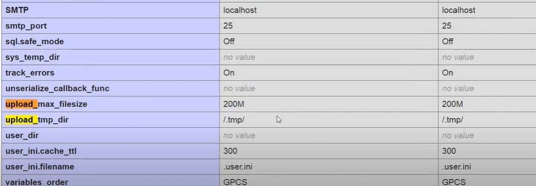

### Upload de archivos con formularios

- Para subir Archivos al servidor se usa <strong> input </strong> de tipo file
- Pero el formulario debe enviarse por POST y tener ENCTYPE con el valor MULTIPART/FROM-DATA
- Aunque noi procesemos el archivo, en realidad se sube al servidor (tmp)
- Este archivo se elimina automaticamente al finalizar de ejecutarse el codigo PHP

### Restricciones

- Por defecto el PHP.ini tiene seteado un limite de tamaño maximo de archivo
- Segun la version del servidor isntalado puede ser de 2mb hasta los 64mb
- Generalmente los hosting soportan archis mas grandes
- Si usamos las funcion PHPINFO() para ver la configuracion del php.ini, debemos buscar la directiva UPLOAD_MAX_FILESIZE

```php

phpinfo()

```



- Esta es una directiva que nos epuede configurar desde la funcion ini_set(), por que se interpreta despues de que el apache rechaso el archivo.

### Obteer el archivo

- Los Archivos subidos con un formulario, no se reciben no por GET n i por POST


### Obtener el Archivo

- Los Archivos subisos con un formulario, no se reciben ni por GET ni por POST.
- llegan por la matriz $_Files
- Tiene como indice asociativo cada name de un pmput de tipo file.
- Entonces un $_Files['name_del_input'] accede a un input de tipo con el name=2name_del_input".


### Subir el Archivo

- Ese directorio temporal donde se reciben los archivos está por fuera del directorio raiz de la web publica.
- `move_uploaded_file()` permite mover de carpeta
